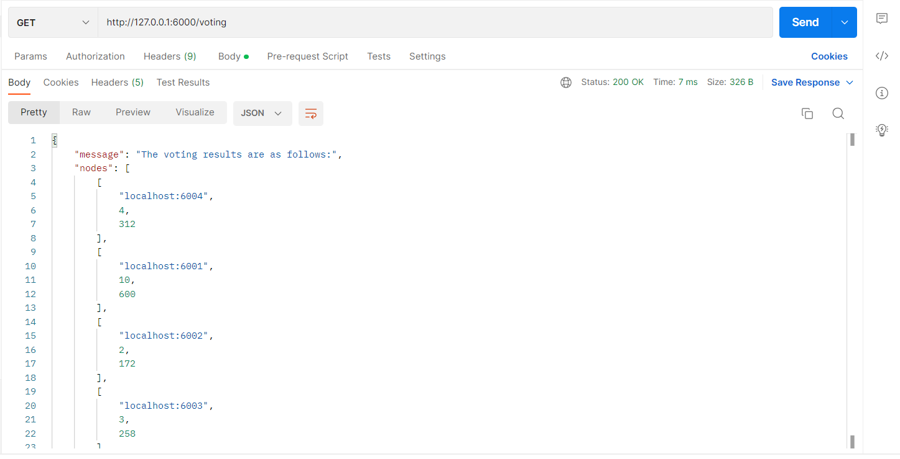

# Blockchain Assignment - 1

## Team members - (Group 37)
1) Debopriya Bhattacharjee (2020A4PS2225H)
2) Anjali (2020A4PS2601H)
3) Sanika Ghanekar (2020AAPS2111H)
4) Reet Agarwal (2020B4A72285H)

## Objective
* This assignment to build a land management system with the following features:
1. To register new users to the system with previously owned property
2. The user should be able to buy and sell the property.
3. To improve the security of the blockchain, incorporate a consensus algorithm that has
been assigned to the group.
4. Implementation of Merkle root to calculate the hash of all the transactions in a block.
5. To be able to view the transaction history that is related to a property.

* We have implemented this in Python-Flask.
* This assignment focuses on implementing the consensus algorithm - __Delegated Proof of Stake__.

## Delegated Proof of Stake (DPoS) algorithm 
A trustworthy, strong, scalable, and effective consensus method for blockchain technology is DPoS. It is an improvement above the common Proof of Stake (PoS). In DPoS, each node with a stake in the system has the ability to vote to assign other nodes the responsibility of validating transactions.

Here, in DPoS ,user's vote weight is proportional to their stake rather than block mining being tied to the stakeholders' total tokens.

## Implementation of DPoS in Dexter's Blockchain
* All the methods are properly defined in Blockchain class of `blockchain.py` and the API routes to interact with the blockchain in `main.py`

### Methods in `blockchain.py`

* We have made `localhost:6000` as a primary node which takes care of adding new nodes to the network, maintain the stakes of those nodes, conduct voting and choose __3 delegate (validator) nodes__ which are authorised to validate transactions and mine new blocks.

* We can add as many nodes as we want to the network using the `nodes/add` API endpoint, but only 3 nodes will be selected as validator (delegate) nodes after the voting process.

* The 3 delegates are chosen from the pool of all stakeholders based on their stakes and votes received, i.e. the top 3 nodes having highest value of `(stake x votes)` are chosen to be the delegates.

* The primary node (localhost:6000) generates the delegate list and all other nodes can view the elected delegates. For this we have a sync() method.
* 

### API endpoints to interact with our blockchain

1). `/nodes/add`

This is the starting stage of setting up our network. The user must input each node's URL and stake individually for this POST route in order to add them to the network. Be sure to run this endpoint from all ports before starting any blockchain transactions.

2). `/voting`

This is a GET route that starts the voting. In this instance, only the primary node has the power to perform voting among all the stake-holding nodes. The error notice will be sent to all other nodes that do not have access to perform voting. The endpoint notifies the main node of the vote results. The address of the node, the node's stake, and the value of (stake x votes) of that node are all included in the JSON response.

Voting results showing address, stake and (votes x stake) of all participating nodes

Nodes apart from the primary node will receive an error if they are not eligible to conduct election.

3). `/delegates/show`

This is a GET route to fetch and view all the delegates selected for mining by the voting process to the primary node. 

4). `/delegates/sync`

Apart from the principal node, all other nodes in the network must use this GET endpoint to retrieve the list of validator nodes.

5). `/transactions/new`

This POST method initiates a new transaction and requires the user to enter the buyer name, seller name, property name and amount in JSON format.

6). `/mine`

The mining of fresh blocks and transaction validation are made easier via this GET endpoint. As per the DPoS consensus mentioned above, only validator nodes can mine new blocks in this case. Additionally, the delegate node can only mine a new block when the pool has at least 2 unverified transactions. No block is under-filled as a result.

If a non-delegate node tries to mine a new block, it will receive this error.

There must be >=2 transactions in a block

Structure of a typical block mined by a delegated node

7). `/chain`

This GET method facilitates the user to view the entire blockchain along with its length.

8). `/chain/resolve`

This endpoint finds the longest validated chain by checking all the neighbouring nodes in the network and resolves conflict if any.

## Tech stack 
* The project is built using Python-Flask framework.
* Postman was used to test and interact with the API endpoints.

## How to run
1) Make sure Python 3.8+ , Flask and requests library is installed.
    * Download any version of Python (>=3.8) from the [official website](https://www.python.org/downloads/).
    * `pip3 install flask`
    * `pip3 install requests`

2) `cd Blockchain` and run the server:
    * `python3 main.py`

        We can open different network ports on the same machine, on different terminals to simulate multinode network
    
    * `python3 main.py -p 6001`
    * `python3 main.py -p 6002`

3) Run the API endpoints on an HTTP Client like [Postman](https://www.postman.com/downloads/).

